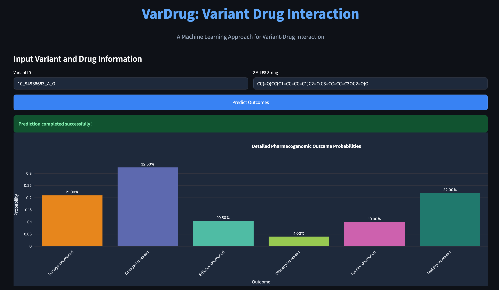

# VarDrug: A Machine Learning Approach for Variant-Drug Interaction, Application to Drugs for Psychiatric Disorders 

## 🧬 Abstract

Predicting variant-drug interactions is essential for advancing precision medicine across therapeutic areas. The Pharmacogenomics Knowledge Base (PharmGKB) dataset, with ~11,000 samples, is underutilized in machine learning (ML) due to its limited size. After filtering for variant mappings and excluding metabolizer-related conditions, we obtain ~4,000 samples for a six-class prediction task (increasing or decreasing toxicity, efficacy, and dosage). We introduce VarDrug, the first ML framework for variant-drug interaction prediction using PharmGKB, designed to model interactions between genetic variants and drugs. VarDrug integrates a self-supervised VariantEncoder pre-trained on 100,000 GRCh38 variants, MolFormer for drug encoding, and gene co-expression profiles for enhanced variant representation. Using SMOTE for class balancing and 5-fold cross-validation, we evaluate five ML models (CatBoost, RandomForest, ExtraTree, DecisionTree, SVC) against label encoding and rule-based baselines. RandomForest achieves a weighted F1 score of 0.66 and top-2 accuracy of 0.93, significantly outperforming baselines (best weighted F1: 0.39). Ablation studies confirm the VariantEncoder’s critical role, while a case study on psychiatric disorders, focusing on borderline personality disorder (BPD), demonstrates biological plausibility with alignment to known pharmacogenetic annotations for genes like ABCB1 and CYP2D6. VarDrug’s approach, mapping drug-gene and mechanism-of-action-gene interactions, offers a scalable framework for optimizing treatment strategies and reducing adverse drug reactions across pharmacogenomic applications.

We introduce **Vardrug**, the first ML framework for variant-drug interaction prediction on PharmGKB. Vardrug combines:

- 🧠 **VariantEncoder**: A self-supervised encoder pre-trained on 100,000 variant samples.
- 💊 **Fingerprint**: A classic drug encoder.
- 🧬 **Gene co-expression profiles**: For enhanced variant representation.

We use **SMOTE** for class balancing and apply **5-fold cross-validation** to evaluate five ML models: `RandomForest`, `CatBoost`, `ExtraTree`, `DecisionTree`, and `SVC`. These are compared against label encoding and rule-based baselines.

**Key Results**:
- **RandomForest** achieves:
  - 🎯 Weighted F1 Score: **0.66**
  - 🎯 Top-2 Accuracy: **0.93**
- Outperforms all baselines (best baseline weighted F1: **0.39**).
- Ablation studies confirm the critical impact of VariantEncoder.
- A case study validates biological plausibility by aligning predictions with known interactions.

**Vardrug** offers a robust and scalable framework to enhance pharmacogenomic predictions, guiding personalized treatments and reducing adverse drug reactions.

> *KarimiNejad et al., 2025*

---

## 🚀 How to Run

1. **Install dependencies**:
   ```bash
   pip install -r requirements.txt
   ```

2. **Install dependencies**:
   ```bash
   streamlit run streamlit_app.py
   ```

## 📸 Screenshot



## 📚 Citation
KarimiNejad M., et al. (2025). Vardrug: A Machine Learning Framework for Variant-Drug Interaction Prediction. [Preprint].

